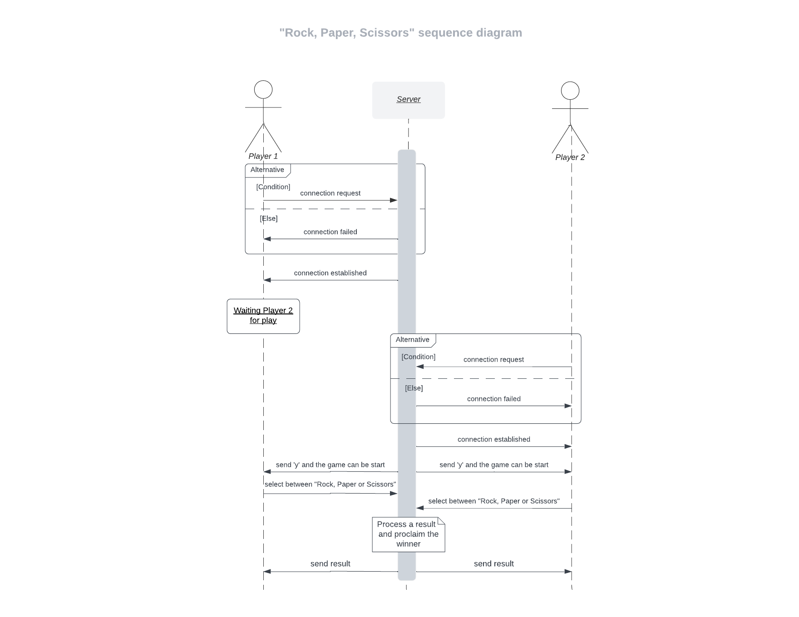

# "Rock, Paper, Scissors" Game

**Python** Client-Server Application of "**Rock, Paper, Scissors**" game.

### GAME RULES:

1. [R]ock breaks [S]cissors  &ensp;&ensp; -> &ensp; [R]ock wins
2. [S]cissors cut [P]aper   &ensp;&ensp;&ensp;&ensp; -> &ensp; [S]cissors win
3. [P]aper wraps [R]ock      &ensp;&ensp;&ensp;&ensp; -> &ensp; [P]aper wins

If there was a **DRAW** (the players make the same choise), the hand must be replayed.


### GAME SEQUENCE DIAGRAM:



## PREREQUISITES

- [Anaconda](https://www.anaconda.com/products/distribution)

&ensp;&ensp;&ensp; or 

- [Python](https://www.python.org/downloads/)

**NOTE**: Use **python 3.8** version or higher!


# GAME INSTALLATION 


**1.** Clone the following **branch**:

```console
   git clone --branch shell_game https://github.com/rocchinaRomano/Rock-paper-scissors.git
```  
        
&ensp;&ensp;&ensp;&ensp;**Otherwise**: Download all contents of ["Rock-paper-scissors"](https://github.com/rocchinaRomano/Rock-paper-scissors/tree/shell_game) branch (On "Code", "Download ZIP")

**2.** After download, unzip "**Rock-paper-scissors-shell_game.zip**" folder


# HOW TO PLAY

**1.** In the "**Rock-paper-scissors-shell_game**" folder, open **three** "Anaconda or Python shell":

   - One for the Server
   - Two for the two Players: "*Player 1*" and "*Player 2*"

**2.** In the **Server shell** type the following command:

```console
   python3 server.py
```  

**3.** In the two **Players shell** type following command:

```console
   python3 client.py
```  

**4.** The **two Players** enter their nickname and the game can be start

**5.** The players make a choise between "**[R]ock, [P]aper or [S]cissors"** and the server proclaims the **winner** according to the game rules.

**NOTE**: In **DRAW** case (the two players make the **same choice**), the two players must replay.

   
# VIDEO TUTORIAL OF GAME

A step-by-step video tutorial of game is available [here](https://github.com/rocchinaRomano/Rock-paper-scissors/blob/video_tutorial/game_tutorial_shell.mp4).


# REGRESSION TEST

## Prerequisities: 

Python "**unittest**"  library

## Run regression test:

In the "**Rock-paper-scissors-shell_game**" folder open one "Anaconda or Python shell" and type the following command:

```console
   python3 test_game.py
```